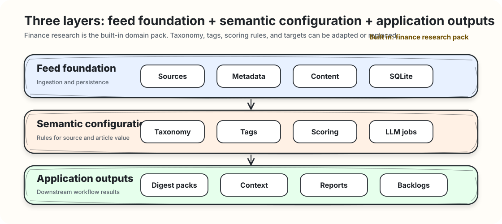

<div align="center">

# wechat-mp-feed

**Agent-first WeChat Official Account feed infrastructure, with a built-in finance research layer.**

[中文文档](docs/zh-CN/README.md) · [Agent Skill](skills/wechat-mp-feed/SKILL.md) · [CLI](docs/cli.md) · [Finance Taxonomy](docs/finance-taxonomy.md)

[](https://github.com/szwang-dev/wechat-mp-feed/actions/workflows/ci.yml)
[](LICENSE)
[](https://www.python.org/)
[](.github/workflows/ci.yml)
[](skills/wechat-mp-feed/SKILL.md)

</div>

`wechat-mp-feed` turns WeChat Official Account content into a local feed that can be reviewed, updated, searched, and used by agents. The feed layer handles source onboarding, article refresh, content extraction, and local storage. The built-in finance research domain pack adds source categories, article categories, tags, scoring rules, and application targets; these settings can be adapted or replaced for other research goals.

The project stores source identity, article metadata, fetched content, image positions, classifications, and digests in local SQLite. Article search and fetching are delegated to a WeChat article download service that you run yourself, such as a Docker container or a process on your machine. See [Feed Configuration](docs/config.md) for the service URL and setup flow.

## Overview

`wechat-mp-feed` focuses on the feed layer between raw WeChat Official Account content and agent-driven applications.

The project has three layers:

- Feed foundation: source identity, article metadata, fetched content, image positions, and local persistence.
- Semantic configuration: taxonomies, tags, scoring rubrics, and LLM jobs for interpreting sources and articles.
- Application outputs: digest packs, digest context, and structured exports for downstream workflows.



## Core Workflow

1. Import source candidates from account lists, screenshots, recordings, or article URLs.
2. Resolve account identity through the configured downloader adapter.
3. Review uncertain matches and confirm source classifications.
4. Backfill recent article metadata after onboarding.
5. Refresh article metadata incrementally for reviewed sources.
6. Run metadata-stage and content-stage LLM analysis through JSON jobs.
7. Fetch retained article content and cache assets for high-value articles.
8. Export feed status, digest packs, and digest context for downstream applications.

## Outputs

`wechat-mp-feed` produces four groups of artifacts:

- Source registry: confirmed accounts, status, tiers, identity fields, and classifications.
- Article store: article metadata, fetched text, HTML, structured content, image links, and image order.
- Run reports: feed summaries, failure tables, retry context, and downloader health signals.
- Agent context: LLM jobs, digest packs, and digest context for downstream applications.

For table-level details, see [Storage Schema](docs/schema.md).

## Domain Packs

Domain packs define how feed data enters a concrete application. They include source categories, article categories, source attributes, tags, scoring rubrics, retention thresholds, and application targets. Users can replace or extend the domain pack for finance research, industry intelligence, policy tracking, media monitoring, or other research workflows.

The built-in finance research pack covers macro, strategy, fixed income, quant, industry research, company research, market infrastructure, media, and KOL sources. It also provides article scoring rules and application targets such as `daily_digest`, `weekly_report`, `strategy_backlog`, `market_view`, `industry_tracking`, and `risk_monitoring`.

See [Finance Taxonomy](docs/finance-taxonomy.md).

## Agent Integration

The project ships a canonical agent skill:

```text
skills/wechat-mp-feed/
```

Agents use `mpfeed` for first-run onboarding, feed refreshes, failure inspection, LLM job export/import, single-source intake, unsubscribe, and reactivation. The CLI exposes structured outputs and controlled write paths for Codex, Claude Code, and other agent systems.

See [Agent Skill](docs/agent-skills.md) and [CLI Reference](docs/cli.md).

## Quick Start

The offline demo uses synthetic data and does not require WeChat authentication.

```bash
PYTHONPATH=packages/wechat_mp_feed/src python3 -m wechat_mp_feed.cli \
  --db ./work/demo-feed.sqlite \
  demo seed-feed \
  --work-dir ./work/demo-feed

PYTHONPATH=packages/wechat_mp_feed/src python3 -m wechat_mp_feed.cli \
  run feed \
  --config ./work/demo-feed/feed-config.demo.json
```

Generated files:

```text
work/demo-feed/feed-items.csv
work/demo-feed/feed-summary.json
work/demo-feed/feed-failures.csv
```

For the WeChat article download service, source onboarding, and feed configuration, use the documentation links below.

## Documentation

| Topic | Link |
|---|---|
| Architecture | [docs/architecture.md](docs/architecture.md) |
| CLI Reference | [docs/cli.md](docs/cli.md) |
| Downloader Adapter Contract | [docs/downloader-adapter.md](docs/downloader-adapter.md) |
| Feed Configuration | [docs/config.md](docs/config.md) |
| Storage Schema | [docs/schema.md](docs/schema.md) |
| Agent Skill | [docs/agent-skills.md](docs/agent-skills.md) |
| Finance Taxonomy | [docs/finance-taxonomy.md](docs/finance-taxonomy.md) |
| Chinese Documentation | [docs/zh-CN/README.md](docs/zh-CN/README.md) |

## Data And Privacy

`wechat-mp-feed` stores operational data locally. Real account lists, screenshots or recordings, downloader credentials, article archives, SQLite databases, generated feed files, and personal digests should live in user-controlled local paths such as `work/`, `data/`, or a private directory outside the checkout.

Recommended environment overrides:

```bash
export WECHAT_MP_FEED_HOME=/path/to/private/mpfeed
export WECHAT_MP_FEED_DB=/path/to/private/mpfeed.sqlite
export WECHAT_DOWNLOAD_API_BASE_URL=http://127.0.0.1:5000
```

## License

Licensed under the Apache License, Version 2.0.

Copyright 2026 szwang.
