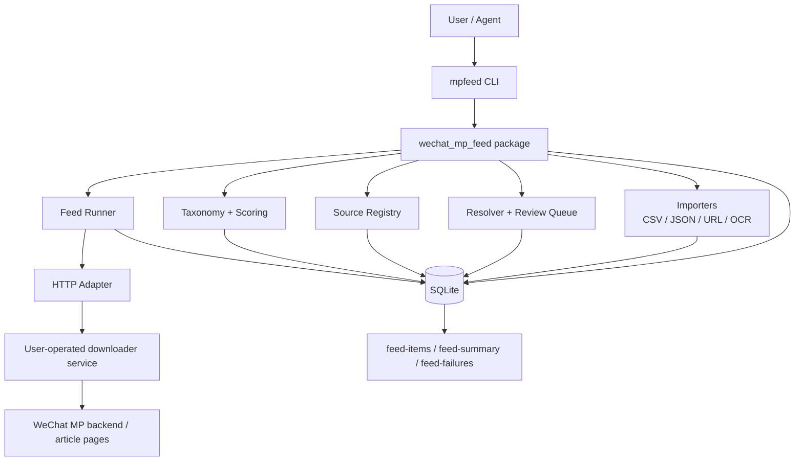
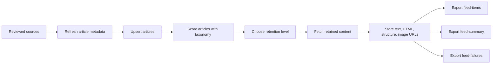
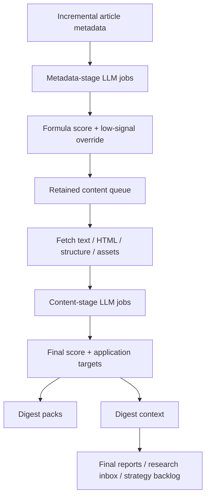
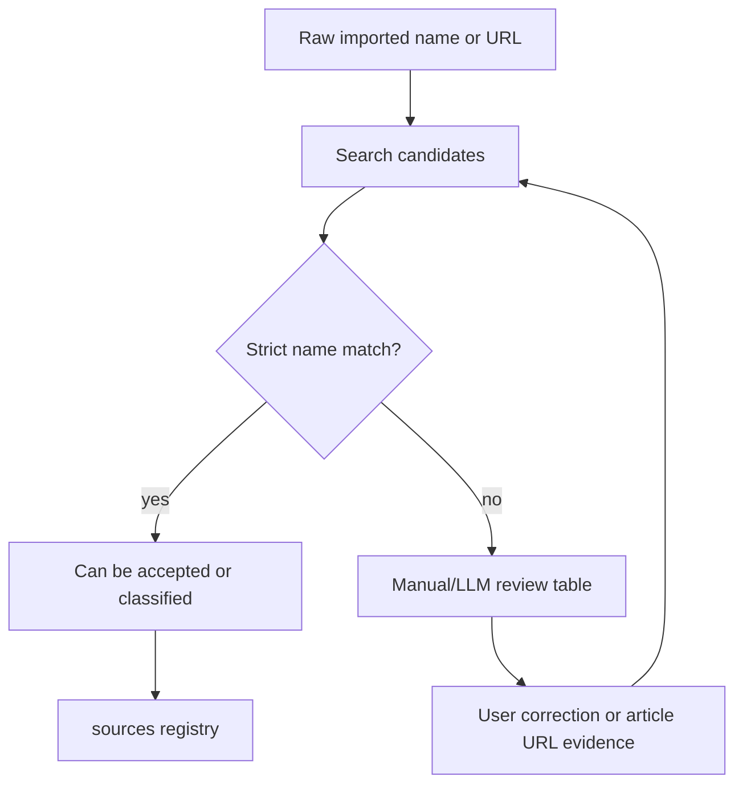

# Architecture

`wechat-mp-feed` is the orchestration layer for a local, reviewable WeChat Official Account feed. The feed layer calls a user-operated downloader service through an adapter, normalizes account and article data, and stores feed data in SQLite. Domain packs define taxonomy, scoring rules, tags, source attributes, and application targets; the built-in finance research pack is the default domain package.

## Layered Shape

## Responsibilities

| layer | responsibility |
|---|---|
| Importers | Preserve raw account names, article URLs, screenshots, or recording OCR output. |
| Resolver | Search account candidates through the configured adapter and keep ambiguous matches reviewable. |
| Review Queue | Promote only confirmed candidates into the long-term `sources` registry. |
| Source Registry | Store canonical account identity, tier, status, fakeid, `__biz`, and optional classification. |
| Feed Runner | Refresh article metadata, run scoring, fetch retained content, and export feed files. |
| Storage | Keep source imports, candidates, sources, articles, content, assets, classifications, and digests in local SQLite. |
| Domain Pack | Provide taxonomy, scoring rules, tags, source attributes, and application targets. The included finance pack is the default domain package. |
| Adapters | Hide downloader-specific HTTP details behind stable internal calls. |

## Feed Layer Flow

The first-layer feed produces structured article rows, content availability status, failure reasons, and retention metadata. Application layers can use these outputs for digests, alerts, or research inboxes.

## Semantic Feed Layer

The semantic layer separates selection from final analysis. Metadata-stage jobs favor recall and determine which articles deserve content fetching. Content-stage jobs use fetched article text to produce final scores, application targets, retention levels, and digest records. `digest-context` links final digest rows back to original article text, structured content, and image assets so downstream applications can use source-level evidence.

## Adapter Principle

Keep WeChat-specific access mechanisms behind adapters. The package exposes stable internal models; backend adapters use user-provided session credentials and conservative rate limits.

For the first production path, prefer a long-running HTTP downloader service adapter. The service owns login state, cookies, queueing, cache behavior, and backend-specific operational burden. `wechat-mp-feed` owns source registry, normalized storage, scheduling policy, classification, feed exports, and agent workflow integration.

Services such as `wechat-download-api` stay external. The package accesses them through a base URL and optional token.

## Review Boundary

Search handles account identity matching. Account intros and latest articles provide classification evidence after identity is reviewed.

After account identity and classification review are applied, first-run onboarding should finish with a bounded recent-history metadata backfill. The backfill pages the downloader article-list API for each active source, saves recent article metadata, and gives downstream feed, cadence, and digest workflows a useful starting history instead of an empty database.

## Default Crawl Policy

- Core pool: smaller set, higher priority, more frequent checks.
- Normal pool: broader set, lower frequency.
- Long-tail pool: occasional checks.
- Full content extraction is triggered by source priority or article scoring.
- Failed content fetches are exported as a normal review artifact.

## Data Boundary

The package keeps source registry, article metadata, content records, classifications, and feed exports in local files chosen by the user. In production, account lists, screenshots or recordings, downloader credentials, article archives, SQLite databases, and generated `work/` outputs are private runtime data.
