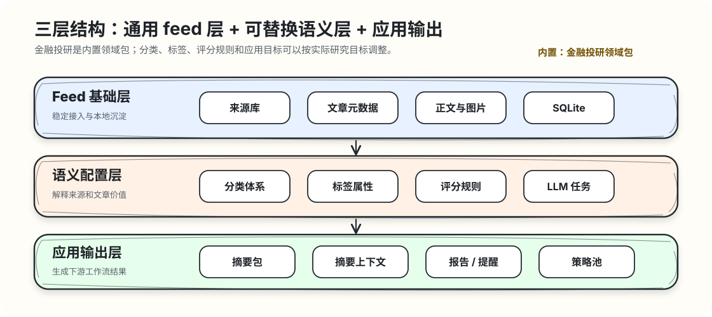

<div align="center">

# wechat-mp-feed 中文说明

**面向 Agent 的微信公众号 feed 基础设施，内置金融投研增强层。**

[English](../../README.md) · [Agent Skill](../../skills/wechat-mp-feed/SKILL.md) · [CLI](cli.md) · [金融分类体系](finance-taxonomy.md)

[](https://github.com/szwang-dev/wechat-mp-feed/actions/workflows/ci.yml)
[](../../LICENSE)
[](https://www.python.org/)
[](../../.github/workflows/ci.yml)
[](../../skills/wechat-mp-feed/SKILL.md)

</div>

`wechat-mp-feed` 用于把微信公众号内容转成本地 feed，支持审核、更新、检索和 agent 调用。核心 feed 层负责来源接入、文章更新、正文提取和本地存储；项目内置金融投研语义层，包含账号分类、文章分类、标签、评分规则和应用目标，并可按实际研究目标调整或替换。

项目在本地 SQLite 中保存来源身份、文章元数据、正文、图片位置、分类和摘要（digest）。公众号搜索和文章抓取由用户自行运行的微信文章下载服务处理，例如 Docker 容器或本机进程。服务地址和配置流程见 [Feed 配置](config.md)。

## 项目概览

`wechat-mp-feed` 位于原始微信公众号内容和 agent 驱动的应用之间，负责稳定的 feed 层。

项目由三层组成：

- Feed 基础层：管理来源身份、文章元数据、正文、图片位置和本地持久化。
- 语义配置层：通过分类体系（taxonomy）、标签、评分规则和 LLM 任务（LLM jobs）解释来源和文章价值。
- 应用输出层：导出摘要包（digest packs）、摘要上下文（digest context）和面向下游工作流的结构化结果。



## 核心流程

1. 从账号列表、截图、录屏或文章链接导入来源候选。
2. 通过配置好的下载服务适配器（adapter）解析账号身份。
3. 审核不确定匹配，并确认来源分类。
4. 首次接入后回补近期文章元数据。
5. 对已审核来源执行增量文章刷新。
6. 通过 JSON 任务（JSON jobs）执行元数据阶段（metadata stage）和正文阶段（content stage）的 LLM 分析。
7. 抓取保留文章正文，并为高价值文章缓存图片资产。
8. 导出 feed 状态、摘要包（digest packs）和下游应用使用的摘要上下文（digest context）。

## 主要产出

`wechat-mp-feed` 的产出分为四类：

- 来源库：已确认的公众号账号、状态、层级、身份字段和分类结果。
- 文章库：文章元数据、正文、HTML、结构化正文、图片链接和图片顺序。
- 运行报告：feed 汇总、失败列表、重试线索和下载服务状态。
- Agent 上下文：LLM 任务（LLM jobs）、摘要包（digest packs）和摘要上下文（digest context）。

表结构细节见 [存储 Schema](schema.md)。

## 领域包

领域包定义 feed 数据如何进入具体应用，包括账号分类、文章分类、来源属性、标签、评分规则、保存阈值和应用目标。用户可以替换或扩展领域包，用于金融投研之外的内容监控、行业情报、政策跟踪或其他研究工作流。

项目内置金融投研领域包，覆盖宏观、策略、固收、金工、行业研究、公司研究、市场基础设施、媒体和 KOL 等来源类型，并提供文章评分规则和 `daily_digest`、`weekly_report`、`strategy_backlog`、`market_view`、`industry_tracking`、`risk_monitoring` 等应用目标。

详见 [金融分类体系](finance-taxonomy.md)。

## Agent 集成

项目提供正式的 agent 技能包（agent skill）：

```text
skills/wechat-mp-feed/
```

Agent 通过 `mpfeed` 执行首次接入、feed 刷新、失败检查、LLM 任务导出/导入、单账号接入、退订和重新启用。CLI 提供结构化输出和受控写入口，适合在 Codex、Claude Code 和其他 agent 系统中调用。

详见 [Agent Skill](agent-skills.md) 和 [CLI 参考](cli.md)。

## 快速开始

离线示例使用合成数据，不需要微信认证。

```bash
PYTHONPATH=packages/wechat_mp_feed/src python3 -m wechat_mp_feed.cli \
  --db ./work/demo-feed.sqlite \
  demo seed-feed \
  --work-dir ./work/demo-feed

PYTHONPATH=packages/wechat_mp_feed/src python3 -m wechat_mp_feed.cli \
  run feed \
  --config ./work/demo-feed/feed-config.demo.json
```

生成文件：

```text
work/demo-feed/feed-items.csv
work/demo-feed/feed-summary.json
work/demo-feed/feed-failures.csv
```

微信文章下载服务、来源接入和 feed 配置请参考下方文档。

## 文档索引

| 主题 | 链接 |
|---|---|
| 架构设计 | [architecture.md](architecture.md) |
| CLI 参考 | [cli.md](cli.md) |
| 下载服务 Adapter 契约 | [downloader-adapter.md](downloader-adapter.md) |
| Feed 配置 | [config.md](config.md) |
| 存储 Schema | [schema.md](schema.md) |
| Agent Skill | [agent-skills.md](agent-skills.md) |
| 金融分类体系 | [finance-taxonomy.md](finance-taxonomy.md) |
| English Documentation | [../../README.md](../../README.md) |

## 数据与隐私

`wechat-mp-feed` 默认把运行数据保存在本地。真实公众号名单、截图或录屏、下载服务登录凭据、原始文章归档、SQLite 数据库、生成的 feed 文件和个人摘要（digest），建议放在用户控制的本地路径中，例如 `work/`、`data/`，或仓库目录之外的私有目录。

推荐使用环境变量指定真实部署路径：

```bash
export WECHAT_MP_FEED_HOME=/path/to/private/mpfeed
export WECHAT_MP_FEED_DB=/path/to/private/mpfeed.sqlite
export WECHAT_DOWNLOAD_API_BASE_URL=http://127.0.0.1:5000
```

## License

本项目使用 Apache License, Version 2.0。

Copyright 2026 szwang.
